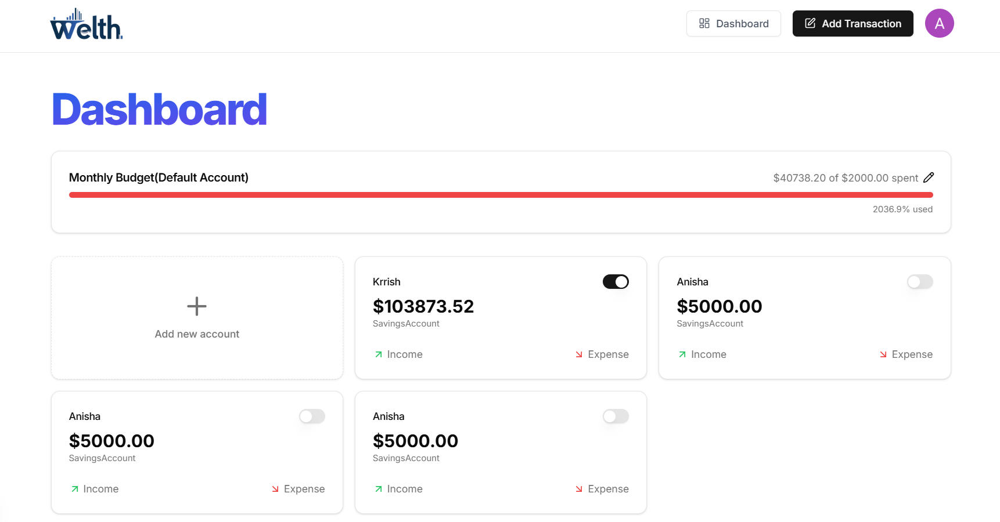
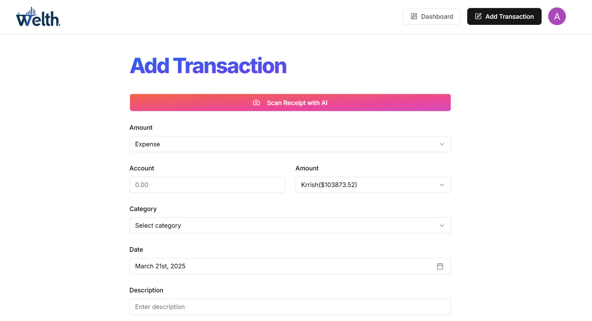
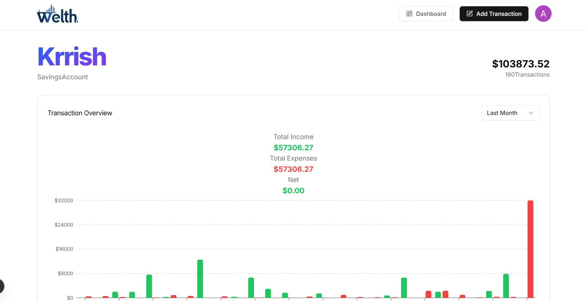
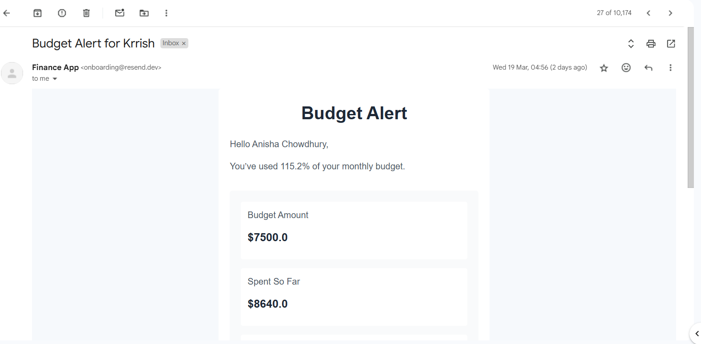

# AI Finance Platform

A comprehensive **AI Finance Platform** built using modern web technologies to provide users with advanced financial tools and insights.

## Features

- **User Authentication**: Secure login and registration system.
- **Financial Dashboards**: Interactive dashboards displaying financial data and analytics.
- **AI-Powered Insights**: Utilize AI to offer personalized financial recommendations.
- **Real-Time Data**: Fetch and display up-to-date financial information.
- **Responsive Design**: Optimized for various devices, ensuring a seamless user experience.

## Technologies Used

- **Next.js**: React framework for server-side rendering and static site generation.
- **Supabase**: Backend-as-a-Service providing authentication and database services.
- **Tailwind CSS**: Utility-first CSS framework for rapid UI development.
- **Prisma**: Next-generation ORM for database management.
- **Inngest**: Event-driven functions for background processing.
- **ArcJet**: AI integration for enhanced financial insights.
- **Shadcn UI**: Component library for building accessible web applications.
  
## Installation & Setup  

**Clone the repository** - `git clone https://github.com/yourusername/lucky-number-game.git`  
**Navigate** - `cd my-app`  
**Install dependencies** - `npm install`  
**Start the development server** - `npm run dev`  
**Open in the browser** - The application will be accessible at `http://localhost:5173`  

## Preview  

  
  
  
  
  
  
